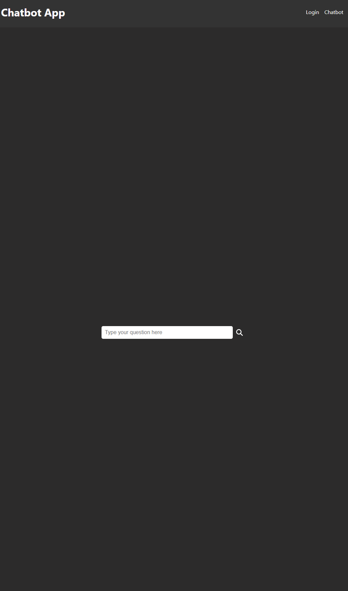

# Chatbot

Chatbot is a full-stack chatbot app powered by the OpenAI API, featuring a React.js frontend and Node.js/Express backend. Designed for seamless interactions, it's hosted on Railway for efficient and scalable deployment.

---

## Features

- **Real-Time AI Chat**: Engage in intelligent, context-aware conversations with the chatbot.
- **User Authentication**: Secure login functionality using Firebase.
- **Responsive Design**: Optimized for both desktop and mobile devices.
- **Scalable Hosting**: Hosted on [Railway](https://railway.app) for reliable deployment.

---

## How It Works

1. **Log In**: Securely authenticate using your credentials.
2. **Start Chatting**: Enter messages in the chat interface and receive instant, intelligent responses.
3. **Explore AI**: Experience dynamic conversational capabilities powered by OpenAI's GPT-4.


[Check out the live app here!](https://your-chatbot-live-link.com)

---

## Installation

To set up the Chatbot application locally, follow these steps:

### Backend Setup

1. Clone the repository:
   ```bash
   git clone https://github.com/JakeDeines/Chatbot.git
   cd Chatbot
